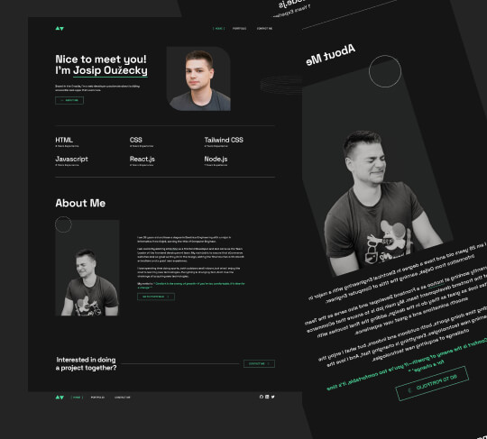

# Personal Portfolio

## [Check my website online](https://www.josipouzecky.dev/)

## Setting Up Locally

1. Download or clone the repository.
2. Run `npm install` (ensure that Node.js and npm are installed).
3. Check `package.json` for available scripts. You have two options:
   - `npm run start `for development
   - `npm run build `for production
4. Enjoy! 😃

## Purpose of This Repository

The main purpose of this repository is to create my personal website, where I can present myself to others—whether a future employer or a potential client.

Another important reason for this project is that I didn’t have any side projects before, but I wanted to start working on something in my free time to acquire new skills and showcase them to the world. This project is my first step in demonstrating what I know. It’s a simple and raw HTML and CSS setup for now, but it’s just the beginning!

So, in short, in 2025, I decided to start my own journey, learning the skills I enjoy and want to use—while having fun along the way! ❤️
