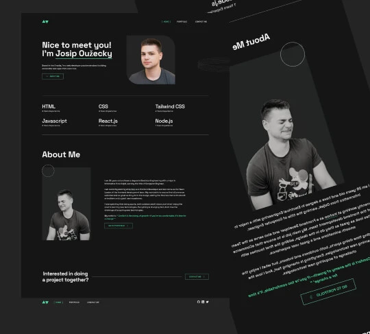

# Personal Portfolio Website

Welcome to my personal portfolio website repository! Visit the live site at [josipouzecky.dev](https://www.josipouzecky.dev/)

## About This Project
This is my personal portfolio website where you can:
- Learn more about who I am
- Explore my projects
- View my skills and experience
- Get in touch with me

## Local Development Setup
To run this project locally, follow these steps:
1. Clone the repository `git clone [repository-url]`
2. Install dependencies `npm install`
3. Run the development server `npm run start`
4. For production build `npm run build`

## Tech Stack
This project is built with:
- HTML
- CSS

While it's a simple tech stack for now, it serves as the foundation for my web development journey. I chose to start with the basics to ensure a solid understanding of core web technologies.

## Project Background
This portfolio marks the beginning of my web development journey in 2025. Previously, I hadn't dedicated time to personal projects, but I've made the decision to change that. This website represents my first step into building a public portfolio of work.

Why start with just HTML and CSS? Because mastering the fundamentals is crucial. As I continue learning and growing, this portfolio will evolve to incorporate more advanced technologies and showcase new projects.

## Future Plans
This is just the beginning! I plan to:
- Add more projects
- Implement new features
- Explore and integrate modern web technologies
- Continue learning and improving

## Get in Touch
Feel free to reach out if you'd like to connect or collaborate!

---

Built with ❤️ by Josip Oužecky