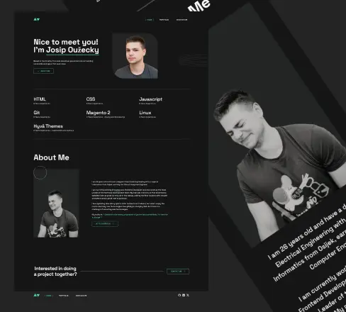

# Personal Portfolio Website

Welcome to my personal portfolio website repository! Visit the live site at [josipouzecky.dev](https://www.josipouzecky.dev/)

## About This Project

This is my personal portfolio website where you can:

- Learn more about who I am
- Explore my projects
- View my skills and experience
- Get in touch with me

## Local Development Setup

To run this project locally, follow these steps:

1. Clone the repository `git clone [repository-url]`
2. Install dependencies `npm install`
3. Run the development server `npm run start`
4. For production build `npm run build`

## Tech Stack

This project is built with:

- HTML
- Vanilla CSS
- JavaScript
- [Parcel](https://parceljs.org/)

---

Built with ❤️ by Josip Oužecky
